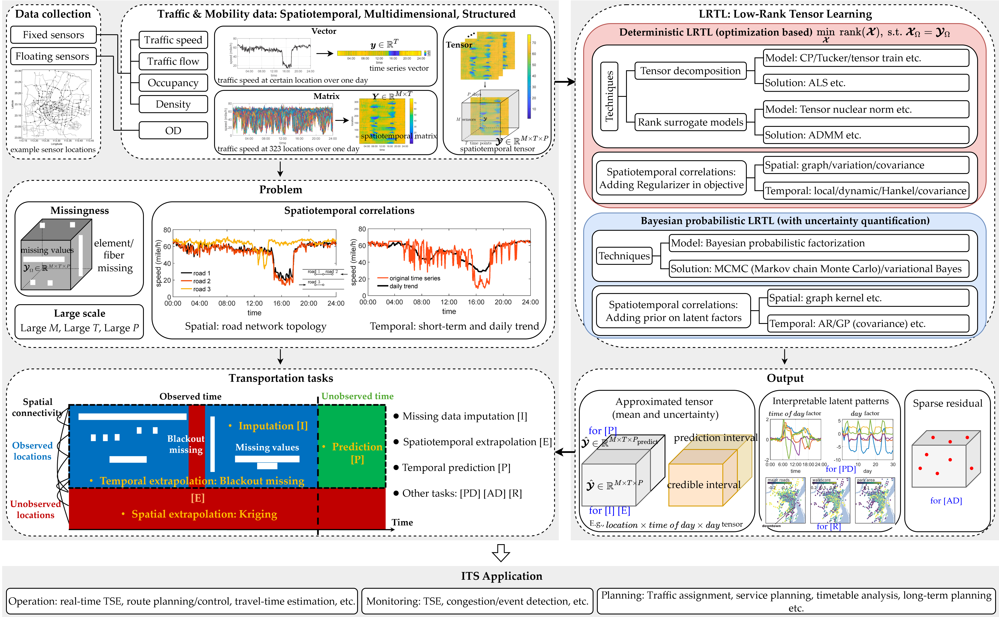
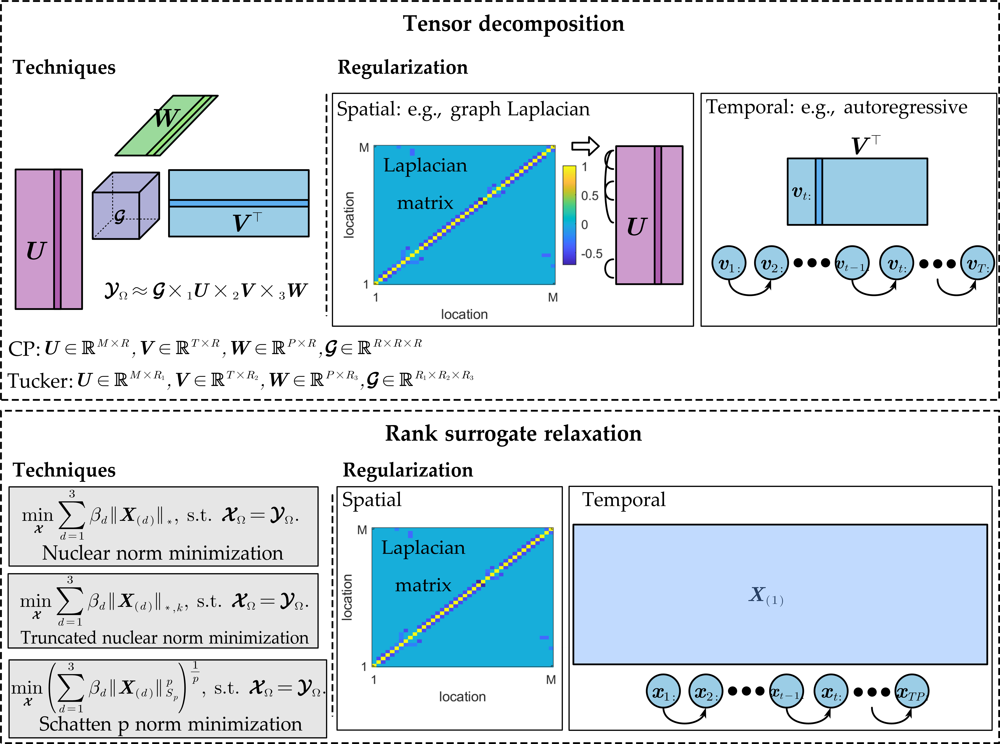
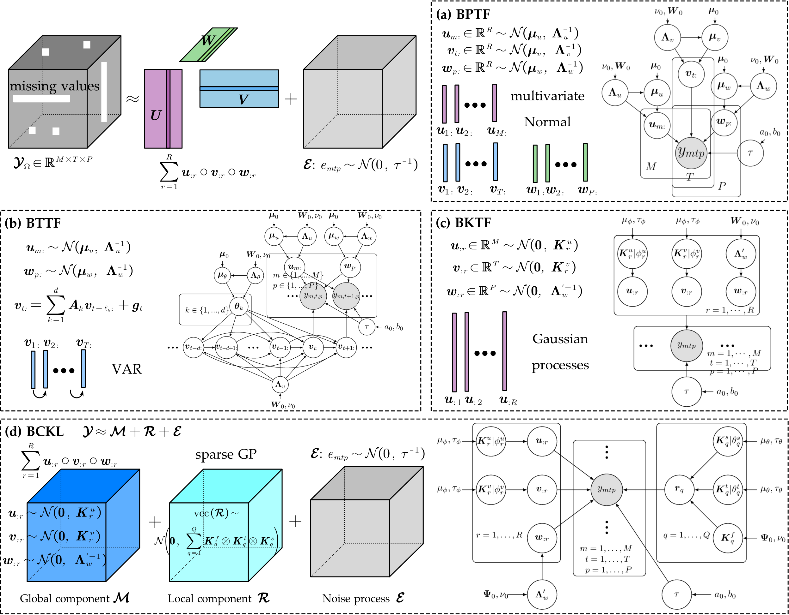
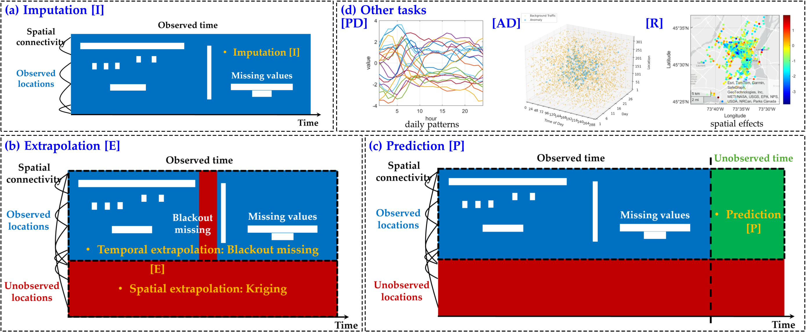
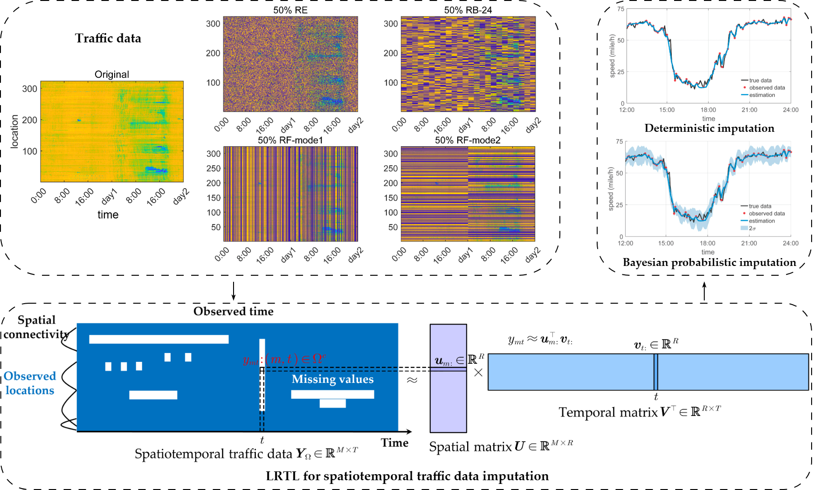
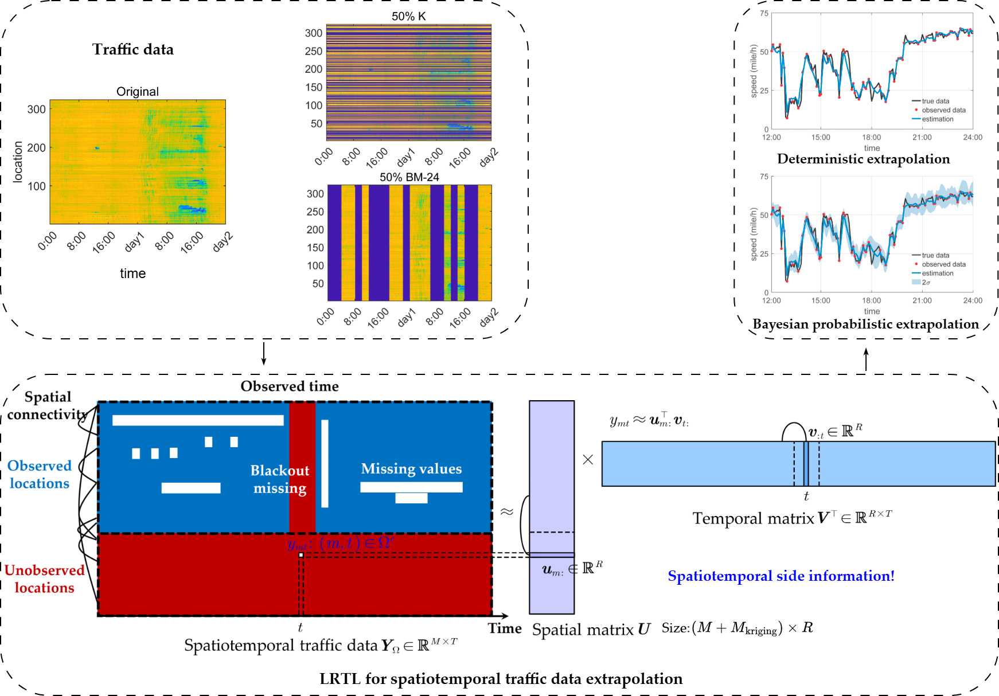
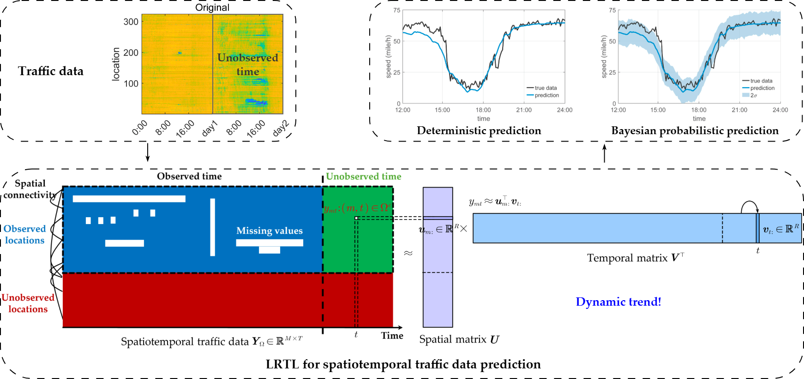
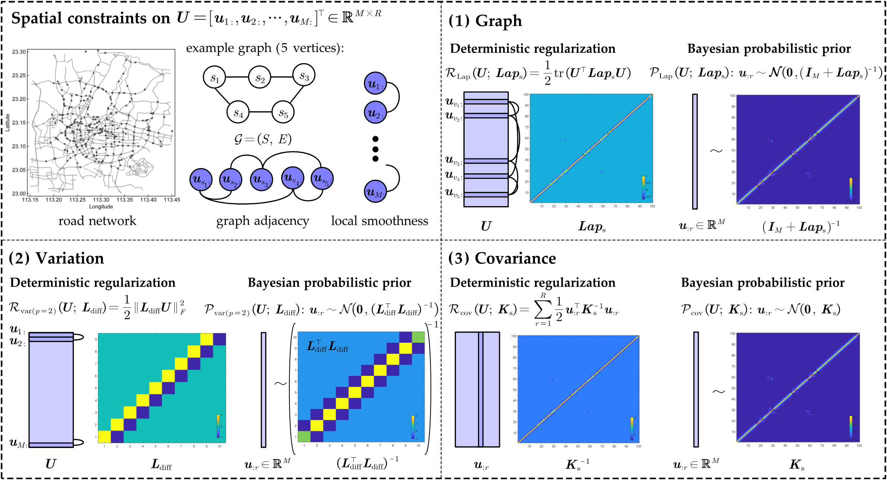

# LRTL4T-Survey

Papers and resources on LRTL (Low-Rank Tensor Learning) for spatiotemporal Transportation (traffic state and mobility) data. 

<p align="center">

</p>

## About
This repository is a companion to our survey:
> Lei, M. and Sun, L. (2025).  
> Low-rank tensor learning for spatiotemporal traffic and mobility data: A survey.
> *Artificial Intelligence for Transportation*, 3, 100035.  
> DOI: 10.1016/j.ait.2025.100035

- :page_facing_up: Survey PDF: [`LRTL4T_Survey.pdf`](LRTL4T_Survey.pdf)  
- :globe_with_meridians: Publisher version: Open access on the [journal page](https://doi.org/10.1016/j.ait.2025.100035)

The goals of this repository are to:
- organize existing LRTL methods for traffic data in a consistent taxonomy;
- provide quick links to papers, preprints, and code;
- highlight relevant datasets that have been used in the literature.

If you work on related topics, feel free to suggest additional references or corrections.

## How the list is organized
The sections below broadly mirror the structure of the survey:
1. **Deterministic LRTL**
   - Tensor decomposition models (CP, Tucker, and variants)
   - Rank-surrogate regularization (nuclear norms, truncated nuclear norms, Schatten-p, etc.)
2. **Bayesian probabilistic LRTL**
   - Bayesian probablistic factorization models with uncertainty quantification
3. **LRTL for transportation tasks**
   - Imputation, extrapolation, prediction, and others
4. **Spatiotemporal constraints**
   - Spatial structure (graphs/Laplacians, variation)  
   - Temporal structure (AR, Hankel, kernel/GP priors)
5. **Datasets**
   - Traffic and mobility benchmarks

Each subsection in 1-4 consists of a table with: paper title → venue → year → (optional) code link.

## Citation
If you find this survey useful for your research, please consider citing:
```bibtex
@article{lei2025lrtl4t,
  title     = {Low-rank tensor learning for spatiotemporal traffic and mobility data: A survey},
  author    = {Lei, Mengying and Sun, Lijun},
  journal   = {Artificial Intelligence for Transportation},
  volume    = {3},
  pages     = {100035},
  year      = {2025},
  publisher = {Elsevier}
}
```

## :bookmark_tabs: Table of Contents
- [Deterministic LRTL](#deterministic-lrtl)
    - [Tensor Decomposition](#tensor-decomposition)
    - [Rank-Surrogate Regularization](#rank-surrogate-regularization)
- [Bayesian Probabilistic LRTL](#bayesian-probabilistic-lrtl)
    - [Bayesian Probabilistic Factorization](#bayesian-probabilistic-factorization)
- [LRTL for Transportation Tasks](#lrtl-for-transportation-tasks)
    - [Imputation](#imputation)
    - [Extrapolation](#extrapolation)
    - [Prediction](#prediction)
    - [Other Tasks](#other-tasks)
- [Spatiotemporal Constraints](#spatial-constraints)
    - [Spatial Constraints](#spatial-constraints)
    - [Temporal Constraints](#temporal-constraints)
- [Datasets](#datasets)

## Deterministic LRTL
<p align="center">

</p>

### Tensor Decomposition
#### CP
| Paper | Venue | Date | Code |
| -------- | :--------: | -------- | :--------: |
| [Accurate Recovery of Internet Traffic Data Under Variable Rate Measurements](https://doi.org/10.1109/TNET.2018.2819504) | IEEE/ACM Transactions on Networking | 2018 | |
| [A Fused CP Factorization Method for Incomplete Tensors](https://doi.org/10.1109/TNNLS.2018.2851612) | IEEE TNNLS | 2018 | |
| [Revealing heterogeneous spatiotemporal traffic flow patterns of urban road network via tensor decomposition-based clustering approach](https://doi.org/10.1016/j.physa.2019.03.053) | Physica A: Statistical Mechanics and its Applications | 2019 | |
| [Learning Spatiotemporal Latent Factors of Traffic via Regularized Tensor Factorization: Imputing Missing Values and Forecasting](https://doi.org/10.1109/TKDE.2019.2954868) | IEEE TKDE | 2019 | |
| [Embedding Traffic Network Characteristics Using Tensor for Improved Traffic Prediction](https://doi.org/10.1109/TITS.2020.2984175) | IEEE TITS | 2020 | |
| [Urban road traffic condition forecasting based on sparse ride-hailing service data](https://doi.org/10.1049/iet-its.2019.0338) | IET Intelligent Transport Systems | 2020 | |
| [Spatial—Temporal Traffic Flow Data Restoration and Prediction Method Based on the Tensor Decomposition](https://doi.org/10.3390/app11199220) | Applied Sciences | 2021 | |
| [Spatiotemporal Tensor Completion for Improved Urban Traffic Imputation](https://doi.org/10.1109/TITS.2021.3062999) | IEEE TITS | 2021 | |
| [Diagnosing Spatiotemporal Traffic Anomalies With Low-Rank Tensor Autoregression](https://doi.org/10.1109/TITS.2020.3044466) | IEEE TITS | 2021 | |
| [Traffic forecasting with missing data via low rank dynamic mode decomposition of tensor](https://doi.org/10.1049/itr2.12200) | IET Intelligent Transport Systems | 2022 | |
| [A Data Fusion CANDECOMP-PARAFAC Method for Interval-wise Missing Network Volume Imputation](https://doi.org/10.1109/TITS.2023.3289193) | IEEE TITS | 2023 | |
| [Generalized Least Squares Kernelized Tensor Factorization](https://arxiv.org/abs/2412.07041) | arXiv | 2024 | [GitHub](https://github.com/MengyingLei/GLSKF) |
#### Tucker
| Paper | Venue | Date | Code |
| -------- | :--------: | -------- | :--------: |
| [A tensor-based method for missing traffic data completion](https://doi.org/10.1016/j.trc.2012.12.007) | Transportation Research Part C | 2013 | |
| [Spatial-temporal traffic speed patterns discovery and incomplete data recovery via SVD-combined tensor decomposition](https://doi.org/10.1016/j.trc.2017.10.023) | Transportation Research Part C | 2018 | |
| [Tensor Decomposition for Spatial—Temporal Traffic Flow Prediction with Sparse Data](https://doi.org/10.3390/s20216046) | Sensors | 2020 | |
| [Urban Traffic Data Imputation With Detrending and Tensor Decomposition](https://doi.org/10.1109/ACCESS.2020.2964299) | IEEE Access | 2020 | |
| [Discovering Dynamic Patterns From Spatiotemporal Data With Time-Varying Low-Rank Autoregression](https://doi.org/10.1109/TKDE.2023.3294440) | IEEE TKDE | 2023 | [GitHub](https://github.com/xinychen/vars) |
| [A Fast Spatial-temporal Information Compression algorithm for online real-time forecasting of traffic flow with complex nonlinear patterns](https://doi.org/10.1016/j.chaos.2024.114852) | Chaos, Solitons & Fractals | 2024 | |
| [Spatial–temporal regularized tensor decomposition method for traffic speed data imputation](https://doi.org/10.1007/s41060-023-00412-w) | International Journal of Data Science and Analytics | 2024 | |
| [TuckerAPP: A novel spatiotemporal Tucker decomposition approach for traffic imputation](https://doi.org/10.1016/j.sigpro.2025.110383) | Signal Processing | 2025 | [GitHub](https://github.com/GongWenwuu/STRTD) |
#### Others
| Paper | Venue | Date | Code |
| -------- | :--------: | -------- | :--------: |
| [Short-Term Traffic Prediction Based on Dynamic Tensor Completion](https://doi.org/10.1109/TITS.2015.2513411) | IEEE TITS | 2016 | |
| [Graph Spectral Regularized Tensor Completion for Traffic Data Imputation](https://doi.org/10.1109/TITS.2021.3098637) | IEEE TITS | 2021 | |
| [Spatiotemporal traffic data imputation by synergizing low tensor ring rank and nonlocal subspace regularization](https://doi.org/10.1049/itr2.12383) | IET Intelligent Transport Systems | 2023 | |
| [A 3D Convolution-Incorporated Dimension Preserved Decomposition Model for Traffic Data Prediction](https://doi.org/10.1109/TITS.2024.3486963) | IEEE TITS | 2024 | |
| [A tensor train approach for internet traffic data completion](https://doi.org/10.1007/s10479-021-04147-4) |  Annals of Operations Research | 2024 |
| [Network traffic recovery from link-load measurements using tensor triple decomposition strategy for third-order traffic tensors](https://doi.org/10.1016/j.cam.2024.115901) | Journal of Computational and Applied Mathematics | 2024 | |
| [NT-DPTC: A non-negative temporal dimension preserved tensor completion model for missing traffic data imputation](https://doi.org/10.1016/j.ins.2023.119797) | Information Sciences | 2024 | |
| [Robust Tensor Ring Decomposition for Urban Traffic Data Imputation](https://doi.org/10.1109/TITS.2025.3555449) | IEEE TITS | 2025 | |
| [Kernel Regression of Multi-Way Data via Tensor Trains with Hadamard Overparametrization: The Dynamic Graph Flow Case](https://arxiv.org/abs/2509.22197) | arXiv | 2025 | |
| [Spatiotemporal Factorized Graph Neural Networks for Joint Large-Scale Traffic Prediction and Online Pattern Recognition](https://doi.org/10.1109/TITS.2025.3585197) | IEEE TITS | 2025 | |

### Rank-Surrogate Regularization
#### Nuclear Norm (NN)
| Paper | Venue | Date | Code |
| -------- | :--------: | -------- | :--------: |
| [Tensor based missing traffic data completion with spatial–temporal correlation](https://doi.org/10.1016/j.physa.2015.09.105) | Physica A: Statistical Mechanics and its Applications | 2016 | |
| [Scalable low-rank tensor learning for spatiotemporal traffic data imputation](https://doi.org/10.1016/j.trc.2021.103226) | Transportation Research Part C | 2021 | [GitHub](https://github.com/xinychen/transdim) |
| [Hankel-structured Tensor Robust PCA for Multivariate Traffic Time Series Anomaly Detection](https://arxiv.org/abs/2110.04352) | arXiv | 2021 | |
| [GLOSS: Tensor-based anomaly detection in spatiotemporal urban traffic data](https://doi.org/10.1016/j.sigpro.2021.108370) | Signal Processing | 2022 | |
| [A Novel Spatiotemporal Data Low-Rank Imputation Approach for Traffic Sensor Network](https://doi.org/10.1109/JIOT.2022.3172447) | IEEE Internet of Things Journal | 2022 | |
| [A Learnable Group-Tube Transform Induced Tensor Nuclear Norm and Its Application for Tensor Completion](https://doi.org/10.1137/22M1531907) | SIAM Journal on Imaging Sciences | 2023 | |
| [Internet traffic tensor completion with tensor nuclear norm](https://doi.org/10.1007/s10589-023-00545-5) |  Computational Optimization and Applications | 2024 | |
| [Low-Rank Tensor and Hybrid Smoothness Regularization-Based Approach for Traffic Data Imputation With Multimodal Missing](https://doi.org/10.1109/TITS.2024.3440011) | IEEE TITS | 2024 | |
| [Laplacian Convolutional Representation for Traffic Time Series Imputation](https://doi.org/10.1109/TKDE.2024.3419698) | IEEE TKDE | 2024 | [GitHub](https://github.com/xinychen/LCR) |
| [MNT-TNN: Spatiotemporal Traffic Data Imputation via Compact Multimode Nonlinear Transform-based Tensor Nuclear Norm](https://arxiv.org/abs/2503.22955) | arXiv | 2025 | |
| [A Flexible Approach Based on Hybrid Global Low-Rankness and Smoothness Regularization With Nonlocal Structure for Traffic Data Imputation](https://doi.org/10.1109/TITS.2025.3541448) | IEEE TITS | 2025 | |
| [Dual-domain low-rank tensor completion for traffic data recovery](https://doi.org/10.1016/j.apm.2025.116404) | Applied Mathematical Modelling | 2025 | |
#### Truncated Nuclear Norm (TNN)
| Paper | Venue | Date | Code |
| -------- | :--------: | -------- | :--------: |
| [A nonconvex low-rank tensor completion model for spatiotemporal traffic data imputation](https://doi.org/10.1016/j.trc.2020.102673) | Transportation Research Part C | 2020 | [GitHub](https://github.com/xinychen/transdim) |
| [Spatio-Temporal Constraint-Based Low Rank Matrix Completion Approaches for Road Traffic Networks](https://doi.org/10.1109/TITS.2021.3124613) | IEEE TITS | 2021 | |
| [Low-Rank Autoregressive Tensor Completion for Spatiotemporal Traffic Data Imputation](https://doi.org/10.1109/TITS.2021.3113608) | IEEE TITS | 2021 | [GitHub](https://github.com/xinychen/transdim) |
| [Low-Rank Hankel Tensor Completion for Traffic Speed Estimation](https://doi.org/10.1109/TITS.2023.3247961) | IEEE TITS | 2023 | |
| [Low-Rank Tensor Completion With 3-D Spatiotemporal Transform for Traffic Data Imputation](https://doi.org/10.1109/TITS.2024.3422214) | IEEE TITS | 2024 | |
| [Nonnegative low-rank tensor completion method for spatiotemporal traffic data](https://doi.org/10.1007/s11042-023-15511-w) | Multimedia Tools and Applications | 2024 | |
| [Convolutional Low-Rank Tensor Representation for Structural Missing Traffic Data Imputation](https://doi.org/10.1109/TITS.2024.3430039) | IEEE TITS | 2024 | |
#### Schatten-p
| Paper | Venue | Date | Code |
| -------- | :--------: | -------- | :--------: |
| [Urban network-wide traffic speed estimation with massive ride-sourcing GPS traces](https://doi.org/10.1016/j.trc.2020.01.023) | Transportation Research Part C | 2020 | |
| [Truncated tensor Schatten p-norm based approach for spatiotemporal traffic data imputation with complicated missing patterns](https://doi.org/10.1016/j.trc.2022.103737) | Transportation Research Part C | 2022 | [GitHub](https://github.com/tongnie/tensorlib) |
| [Spatio-Temporal Traffic Data Tensor Restoration Method Based on Direction Weighting and P-Shrinkage Norm](https://doi.org/10.1155/2022/3304677) | Mathematical Problems in Engineering | 2022 | |
| [Classification of the Traffic Status Subcategory with ETC Gantry Data: An Improved Support Tensor Machine Approach](https://doi.org/10.1155/2023/2765937) | Journal of Advanced Transportation | 2023 | |
| [Correlating sparse sensing for large-scale traffic speed estimation: A Laplacian-enhanced low-rank tensor kriging approach](https://doi.org/10.1016/j.trc.2023.104190) | Transportation Research Part C | 2023 | [GitHub](https://github.com/tongnie/tensor4kriging) |
| [A Flexible and Robust Tensor Completion Approach for Traffic Data Recovery With Low-Rankness](https://doi.org/10.1109/TITS.2023.3319033) | IEEE TITS | 2023 | [GitHub](https://github.com/LiyangHu97/RSCPN) |
#### Others
| Paper | Venue | Date | Code |
| -------- | :--------: | -------- | :--------: |
| [Accurate Recovery of Internet Traffic Data: A Sequential Tensor Completion Approach](https://doi.org/10.1109/TNET.2018.2797094) | IEEE/ACM Transactions on Networking | 2018 | |
| [HRST-LR: A Hessian Regularization Spatio-Temporal Low Rank Algorithm for Traffic Data Imputation](https://doi.org/10.1109/TITS.2023.3279321) | IEEE TITS | 2023 | |
| [Spatiotemporal traffic data completion with truncated minimax-concave penalty](https://doi.org/10.1016/j.trc.2024.104657) | Transportation Research Part C | 2024 | |
| [Composite Nonconvex Low-Rank Tensor Completion With Joint Structural Regression for Traffic Sensor Networks Data Recovery](https://doi.org/10.1109/TCSS.2024.3406629) | IEEE Transactions on Computational Social Systems | 2024 | |
| [Low-Rank and Deep Plug-and-Play Priors for Missing Traffic Data Imputation](https://doi.org/10.1109/TITS.2024.3493864) | IEEE TITS | 2024 | |
| [Tensor Train Factorization with Spatio-temporal Smoothness for Streaming Low-rank Tensor Completion](https://doi.org/10.1007/s11464-021-0443-6) | Frontiers of Mathematics | 2024 | |
| [Vehicle State Recovery: A Tailored Laplace Function-Based Tensor Completion Approach](https://doi.org/10.1109/TIV.2024.3471810) | IEEE Transactions on Intelligent Vehicles | 2024 | |
| [Missing Traffic Data Imputation based on Tensor Completion and Graph Network Fusion](https://doi.org/10.1177/03611981251330889) | Transportation Research Record | 2025 | |
| [Robust Tensor Completion via Gradient Tensor Nuclear L1-L2 Norm for Traffic Data Recovery](https://arxiv.org/abs/2506.22732) | arXiv | 2025 | [GitHub](https://github.com/HaoShu2000/RTC-GTNLN) |

## Bayesian Probabilistic LRTL
### Bayesian Probabilistic Factorization
<p align="center">

</p>

#### CP-B
| Paper | Venue | Date | Code |
| -------- | :--------: | -------- | :--------: |
| [Missing traffic data imputation and pattern discovery with a Bayesian augmented tensor factorization model](https://doi.org/10.1016/j.trc.2019.03.003) | Transportation Research Part C | 2019 | [GitHub](https://github.com/xinychen/transdim) |
| [A Bayesian tensor decomposition approach for spatiotemporal traffic data imputation](https://doi.org/10.1016/j.trc.2018.11.003) | Transportation Research Part C | 2019 | [GitHub](https://github.com/xinychen/transdim) |
| [Simultaneous Incomplete Traffic Data Imputation and Similarity Pattern Discovery with Bayesian Nonparametric Tensor Decomposition](https://doi.org/10.1155/2020/8810753) | Journal of advanced transportation | 2020 | |
| [Nonrecurrent traffic congestion detection with a coupled scalable Bayesian robust tensor factorization model](https://doi.org/10.1016/j.neucom.2020.10.091) | Neurocomputing | 2021 | |
| [Bayesian Temporal Factorization for Multidimensional Time Series Prediction](https://doi.org/10.1109/TPAMI.2021.3066551) | IEEE TPAMI | 2021 | [GitHub](https://github.com/xinychen/transdim) |
| [Short term prediction of wireless traffic based on tensor decomposition and recurrent neural network](https://doi.org/10.1007/s42452-021-04761-8) | SN Applied Sciences | 2021 | |
| [Deep spatial-temporal bi-directional residual optimisation based on tensor decomposition for traffic data imputation on urban road network](https://doi.org/10.1007/s10489-021-03060-4) | Applied Intelligence | 2022 | |
| [A Bayesian robust CP decomposition approach for missing traffic data imputation](https://doi.org/10.1007/s11042-022-13069-7) |  Multimedia Tools and Applications | 2022 | |
| [Bayesian Kernelized Matrix Factorization for Spatiotemporal Traffic Data Imputation and Kriging](https://doi.org/10.1109/TITS.2022.3161792) | IEEE TITS | 2022 | [GitHub](https://github.com/MengyingLei/stBKLM) |
| [Bayesian Complementary Kernelized Learning for Multidimensional Spatiotemporal Data](https://arxiv.org/abs/2208.09978) | arXiv | 2022 | [GitHub](https://github.com/MengyingLei/stBKLM) |
| [Multi-residual tensor completion for spatiotemporal data imputation](https://doi.org/10.1016/j.iot.2024.101114) | Internet of Things | 2024 | |
| [Scalable Spatiotemporally Varying Coefficient Modeling with Bayesian Kernelized Tensor Regression](https://doi.org/10.1214/24-BA1428) | Bayesian Analysis | 2024 | [GitHub](https://github.com/MengyingLei/stBKLM) [CRAN](https://cran.r-project.org/package=BKTR) |
| [Bayesian Robust Tensor Decomposition Based on MCMC Algorithm for Traffic Data Completion](https://doi.org/10.1049/sil2/4762771) | IET Signal Processing | 2025 | |
| [Collaborative Bayesian Tensor Factorization-Based Reliable Traffic Speed Data Prediction in T-CPS](https://doi.org/10.1109/TITS.2025.3564318) | IEEE TITS | 2025 | |
#### Others
| Paper | Venue | Date | Code |
| -------- | :--------: | -------- | :--------: |
| [A BPCA based missing value imputing method for traffic flow volume data](https://doi.org/10.1109/IVS.2008.4621153) | IEEE Symposium on Intelligent Vehicle | 2008 | |
| [Traffic Estimation and Prediction via Online Variational Bayesian Subspace Filtering](https://doi.org/10.1109/TITS.2020.3048959) | IEEE TITS | 2021 | |
| [A Low-Rank Bayesian Temporal Matrix Factorization for the Transfer Time Prediction Between Metro and Bus Systems](https://doi.org/10.1109/TITS.2023.3349211) | IEEE TITS | 2024 | |
| [Sparse Bayesian Tensor Completion for Data Recovery in Intelligent IoT Systems](https://doi.org/10.1109/JIOT.2024.3378202) | IEEE Internet of Things Journal | 2024 | |
| [A Bayesian tensor ring decomposition model with automatic rank determination for spatiotemporal traffic data imputation](https://doi.org/10.1016/j.apm.2024.115654) | Applied Mathematical Modelling | 2025 | |

## LRTL for Transportation Tasks
<p align="center">

</p>

### Imputation
<p align="center">

</p>

| Paper | Venue | Date | Technique | Code |
| -------- | :--------: | -------- | :--------: | :--------: |
| [A tensor-based method for missing traffic data completion](https://doi.org/10.1016/j.trc.2012.12.007) | Transportation Research Part C | 2013 | Tucker | | 
| [Tensor based missing traffic data completion with spatial–temporal correlation](https://doi.org/10.1016/j.physa.2015.09.105) | Physica A: Statistical Mechanics and its Applications | 2016 | NN | |
| [A Fused CP Factorization Method for Incomplete Tensors](https://doi.org/10.1109/TNNLS.2018.2851612) | IEEE TNNLS | 2018 | CP | |
| [Spatial-temporal traffic speed patterns discovery and incomplete data recovery via SVD-combined tensor decomposition](https://doi.org/10.1016/j.trc.2017.10.023) | Transportation Research Part C | 2018 | Tucker | |
| [Accurate Recovery of Internet Traffic Data Under Variable Rate Measurements](https://doi.org/10.1109/TNET.2018.2819504) | IEEE/ACM Transactions on Networking | 2018 | CP | |
| [Learning Spatiotemporal Latent Factors of Traffic via Regularized Tensor Factorization: Imputing Missing Values and Forecasting](https://doi.org/10.1109/TKDE.2019.2954868) | IEEE TKDE | 2019 | CP | |
| [Missing traffic data imputation and pattern discovery with a Bayesian augmented tensor factorization model](https://doi.org/10.1016/j.trc.2019.03.003) | Transportation Research Part C | 2019 | CP-B | [GitHub](https://github.com/xinychen/transdim) |
| [A Bayesian tensor decomposition approach for spatiotemporal traffic data imputation](https://doi.org/10.1016/j.trc.2018.11.003) | Transportation Research Part C | 2019 | CP-B | [GitHub](https://github.com/xinychen/transdim) |
| [Urban road traffic condition forecasting based on sparse ride-hailing service data](https://doi.org/10.1049/iet-its.2019.0338) | IET Intelligent Transport Systems | 2020 | CP | |
| [Tensor Decomposition for Spatial—Temporal Traffic Flow Prediction with Sparse Data](https://doi.org/10.3390/s20216046) | Sensors | 2020 | Tucker | |
| [Urban Traffic Data Imputation With Detrending and Tensor Decomposition](https://doi.org/10.1109/ACCESS.2020.2964299) | IEEE Access | 2020 | Tucker | |
| [A nonconvex low-rank tensor completion model for spatiotemporal traffic data imputation](https://doi.org/10.1016/j.trc.2020.102673) | Transportation Research Part C | 2020 | TNN | [GitHub](https://github.com/xinychen/transdim) |
| [Simultaneous Incomplete Traffic Data Imputation and Similarity Pattern Discovery with Bayesian Nonparametric Tensor Decomposition](https://doi.org/10.1155/2020/8810753) | Journal of advanced transportation | 2020 | CP-B | |
| [Spatial—Temporal Traffic Flow Data Restoration and Prediction Method Based on the Tensor Decomposition](https://doi.org/10.3390/app11199220) | Applied Sciences | 2021 | CP | |
| [Spatiotemporal Tensor Completion for Improved Urban Traffic Imputation](https://doi.org/10.1109/TITS.2021.3062999) | IEEE TITS | 2021 | CP | |
| [Graph Spectral Regularized Tensor Completion for Traffic Data Imputation](https://doi.org/10.1109/TITS.2021.3098637) | IEEE TITS | 2021 | SVD | |
| [Spatio-Temporal Constraint-Based Low Rank Matrix Completion Approaches for Road Traffic Networks](https://doi.org/10.1109/TITS.2021.3124613) | IEEE TITS | 2021 | TNN | |
| [Scalable low-rank tensor learning for spatiotemporal traffic data imputation](https://doi.org/10.1016/j.trc.2021.103226) | Transportation Research Part C | 2021 | NN | [GitHub](https://github.com/xinychen/transdim) |
| [Bayesian Temporal Factorization for Multidimensional Time Series Prediction](https://doi.org/10.1109/TPAMI.2021.3066551) | IEEE TPAMI | 2021 | CP-B | [GitHub](https://github.com/xinychen/transdim) |
| [Low-Rank Autoregressive Tensor Completion for Spatiotemporal Traffic Data Imputation](https://doi.org/10.1109/TITS.2021.3113608) | IEEE TITS | 2021 | TNN | [GitHub](https://github.com/xinychen/transdim) |
| [Truncated tensor Schatten p-norm based approach for spatiotemporal traffic data imputation with complicated missing patterns](https://doi.org/10.1016/j.trc.2022.103737) | Transportation Research Part C | 2022 | Schatten-p | [GitHub](https://github.com/tongnie/tensorlib) |
| [Deep spatial-temporal bi-directional residual optimisation based on tensor decomposition for traffic data imputation on urban road network](https://doi.org/10.1007/s10489-021-03060-4) | Applied Intelligence | 2022 | CP-B | |
| [A Bayesian robust CP decomposition approach for missing traffic data imputation](https://doi.org/10.1007/s11042-022-13069-7) |  Multimedia Tools and Applications | 2022 | CP-B | |
| [Bayesian Kernelized Matrix Factorization for Spatiotemporal Traffic Data Imputation and Kriging](https://doi.org/10.1109/TITS.2022.3161792) | IEEE TITS | 2022 | CP-B | [GitHub](https://github.com/MengyingLei/stBKLM) |
| [Bayesian Complementary Kernelized Learning for Multidimensional Spatiotemporal Data](https://arxiv.org/abs/2208.09978) | arXiv | 2022 | CP-B | [GitHub](https://github.com/MengyingLei/stBKLM) |
| [A Data Fusion CANDECOMP-PARAFAC Method for Interval-wise Missing Network Volume Imputation](https://doi.org/10.1109/TITS.2023.3289193) | IEEE TITS | 2023 | CP | |
| [Toward urban traffic scenarios and more: a spatio-temporal analysis empowered low-rank tensor completion method for data imputation](https://doi.org/10.1080/13658816.2023.2234434) | International Journal of Geographical Information Science | 2023 | TNN | [Code](https://figshare.com/articles/online_resource/ST-LRTC_Code_Data_zip/20289078) |
| [Correlating sparse sensing for large-scale traffic speed estimation: A Laplacian-enhanced low-rank tensor kriging approach](https://doi.org/10.1016/j.trc.2023.104190) | Transportation Research Part C | 2023 | Schatten-p | [GitHub](https://github.com/tongnie/tensor4kriging) |
| [A Learnable Group-Tube Transform Induced Tensor Nuclear Norm and Its Application for Tensor Completion](https://doi.org/10.1137/22M1531907) | SIAM Journal on Imaging Sciences | 2023 | NN | |
| [Generalized Least Squares Kernelized Tensor Factorization](https://arxiv.org/abs/2412.07041) | arXiv | 2024 | CP | [GitHub](https://github.com/MengyingLei/GLSKF) |
| [Spatial–temporal regularized tensor decomposition method for traffic speed data imputation](https://doi.org/10.1007/s41060-023-00412-w) | International Journal of Data Science and Analytics | 2024 | Tucker | |
| [A tensor train approach for internet traffic data completion](https://doi.org/10.1007/s10479-021-04147-4) |  Annals of Operations Research | 2024 | TT | |
| [Network traffic recovery from link-load measurements using tensor triple decomposition strategy for third-order traffic tensors](https://doi.org/10.1016/j.cam.2024.115901) | Journal of Computational and Applied Mathematics | 2024 | TD | |
| [Multi-residual tensor completion for spatiotemporal data imputation](https://doi.org/10.1016/j.iot.2024.101114) | Internet of Things | 2024 | CP-B | |
| [Robust Tensor Ring Decomposition for Urban Traffic Data Imputation](https://doi.org/10.1109/TITS.2025.3555449) | IEEE TITS | 2025 | TR | |
| [Bayesian Robust Tensor Decomposition Based on MCMC Algorithm for Traffic Data Completion](https://doi.org/10.1049/sil2/4762771) | IET Signal Processing | 2025 | CP-B | |
| [A Bayesian tensor ring decomposition model with automatic rank determination for spatiotemporal traffic data imputation](https://doi.org/10.1016/j.apm.2024.115654) | Applied Mathematical Modelling | 2025 | TR-B | |

### Extrapolation
<p align="center">

</p>

| Paper | Venue | Date | Technique | Code |
| -------- | :--------: | -------- | :--------: | :--------: |
| [Low-Rank Autoregressive Tensor Completion for Spatiotemporal Traffic Data Imputation](https://doi.org/10.1109/TITS.2021.3113608) | IEEE TITS | 2021 | TNN | [GitHub](https://github.com/xinychen/transdim) |
| [Bayesian Kernelized Matrix Factorization for Spatiotemporal Traffic Data Imputation and Kriging](https://doi.org/10.1109/TITS.2022.3161792) | IEEE TITS | 2022 | CP-B | [GitHub](https://github.com/MengyingLei/stBKLM) |
| [Correlating sparse sensing for large-scale traffic speed estimation: A Laplacian-enhanced low-rank tensor kriging approach](https://doi.org/10.1016/j.trc.2023.104190) | Transportation Research Part C | 2023 | Schatten-p | [GitHub](https://github.com/tongnie/tensor4kriging) |

### Prediction
<p align="center">

</p>

| Paper | Venue | Date | Technique | Code |
| -------- | :--------: | -------- | :--------: | :--------: |
| [Short-Term Traffic Prediction Based on Dynamic Tensor Completion](https://doi.org/10.1109/TITS.2015.2513411) | IEEE TITS | 2016 | TF | |
| [Learning Spatiotemporal Latent Factors of Traffic via Regularized Tensor Factorization: Imputing Missing Values and Forecasting](https://doi.org/10.1109/TKDE.2019.2954868) | IEEE TKDE | 2019 | CP | |
| [Embedding Traffic Network Characteristics Using Tensor for Improved Traffic Prediction](https://doi.org/10.1109/TITS.2020.2984175) | IEEE TITS | 2020 | CP | |
| [Tensor Decomposition for Spatial—Temporal Traffic Flow Prediction with Sparse Data](https://doi.org/10.3390/s20216046) | Sensors | 2020 | Tucker | |
| [Spatial—Temporal Traffic Flow Data Restoration and Prediction Method Based on the Tensor Decomposition](https://doi.org/10.3390/app11199220) | Applied Sciences | 2021 | CP | |
| [Bayesian Temporal Factorization for Multidimensional Time Series Prediction](https://doi.org/10.1109/TPAMI.2021.3066551) | IEEE TPAMI | 2021 | CP-B | [GitHub](https://github.com/xinychen/transdim) |
| [Short term prediction of wireless traffic based on tensor decomposition and recurrent neural network](https://doi.org/10.1007/s42452-021-04761-8) | SN Applied Sciences | 2021 | CP-B | |
| [Traffic forecasting with missing data via low rank dynamic mode decomposition of tensor](https://doi.org/10.1049/itr2.12200) | IET Intelligent Transport Systems | 2022 | CP | |
| [A Fast Spatial-temporal Information Compression algorithm for online real-time forecasting of traffic flow with complex nonlinear patterns](https://doi.org/10.1016/j.chaos.2024.114852) | Chaos, Solitons & Fractals | 2024 | Tucker | |
| [A 3D Convolution-Incorporated Dimension Preserved Decomposition Model for Traffic Data Prediction](https://doi.org/10.1109/TITS.2024.3486963) | IEEE TITS | 2024 | DPD | |

### Other Tasks
#### Pattern Discovery
| Paper | Venue | Date | Technique | Code |
| -------- | :--------: | -------- | :--------: | :--------: |
| [Revealing heterogeneous spatiotemporal traffic flow patterns of urban road network via tensor decomposition-based clustering approach](https://doi.org/10.1016/j.physa.2019.03.053) | Physica A: Statistical Mechanics and its Applications | 2019 | CP | |
| [Simultaneous Incomplete Traffic Data Imputation and Similarity Pattern Discovery with Bayesian Nonparametric Tensor Decomposition](https://doi.org/10.1155/2020/8810753) | Journal of advanced transportation | 2020 | CP-B | |
| [Nonrecurrent traffic congestion detection with a coupled scalable Bayesian robust tensor factorization model](https://doi.org/10.1016/j.neucom.2020.10.091) | Neurocomputing | 2021 | CP-B | |
| [Discovering Dynamic Patterns From Spatiotemporal Data With Time-Varying Low-Rank Autoregression](https://doi.org/10.1109/TKDE.2023.3294440) | IEEE TKDE | 2023 | Tucker | [GitHub](https://github.com/xinychen/vars) |
#### Anomaly Detection
| Paper | Venue | Date | Technique | Code |
| -------- | :--------: | -------- | :--------: | :--------: |
| [Diagnosing Spatiotemporal Traffic Anomalies With Low-Rank Tensor Autoregression](https://doi.org/10.1109/TITS.2020.3044466) | IEEE TITS | 2021 | CP | |
| [Hankel-structured Tensor Robust PCA for Multivariate Traffic Time Series Anomaly Detection](https://arxiv.org/abs/2110.04352) | arXiv | 2021 | NN | |
| [GLOSS: Tensor-based anomaly detection in spatiotemporal urban traffic data](https://doi.org/10.1016/j.sigpro.2021.108370) | Signal Processing | 2022 | NN | |
#### Regression
| Paper | Venue | Date | Technique | Code |
| -------- | :--------: | -------- | :--------: | :--------: |
| [Scalable Spatiotemporally Varying Coefficient Modeling with Bayesian Kernelized Tensor Regression](https://doi.org/10.1214/24-BA1428) | Bayesian Analysis | 2024 | CP-B | [GitHub](https://github.com/MengyingLei/stBKLM) [CRAN](https://cran.r-project.org/package=BKTR) |

## Spatiotemporal Constraints
### Spatial Constraints
<p align="center">

</p>

| Paper | Venue | Date | Constraint | Code |
| -------- | :--------: | -------- | :--------: | :--------: |
| [A Fused CP Factorization Method for Incomplete Tensors](https://doi.org/10.1109/TNNLS.2018.2851612) | IEEE TNNLS | 2018 | 𝓡<sub>Lap</sub> |
| [Revealing heterogeneous spatiotemporal traffic flow patterns of urban road network via tensor decomposition-based clustering approach](https://doi.org/10.1016/j.physa.2019.03.053) | Physica A: Statistical Mechanics and its Applications | 2019 | 𝓡<sub>Lap</sub> | |
| [Urban road traffic condition forecasting based on sparse ride-hailing service data](https://doi.org/10.1049/iet-its.2019.0338) | IET Intelligent Transport Systems | 2020 | 𝓡<sub>Lap</sub> |
| [Toward urban traffic scenarios and more: a spatio-temporal analysis empowered low-rank tensor completion method for data imputation](https://doi.org/10.1080/13658816.2023.2234434) | International Journal of Geographical Information Science | 2023 | 𝓡<sub>Lap</sub> | [Code](https://figshare.com/articles/online_resource/ST-LRTC_Code_Data_zip/20289078) |
| [Correlating sparse sensing for large-scale traffic speed estimation: A Laplacian-enhanced low-rank tensor kriging approach](https://doi.org/10.1016/j.trc.2023.104190) | Transportation Research Part C | 2023 | 𝓡<sub>Lap</sub> | [GitHub](https://github.com/tongnie/tensor4kriging) |
| [Spatial–temporal regularized tensor decomposition method for traffic speed data imputation](https://doi.org/10.1007/s41060-023-00412-w) | International Journal of Data Science and Analytics | 2024 | 𝓡<sub>Lap</sub> |
| [Low-Rank Tensor Completion With 3-D Spatiotemporal Transform for Traffic Data Imputation](https://doi.org/10.1109/TITS.2024.3422214) | IEEE TITS | 2024 | 𝓡<sub>Lap</sub> |
| [Internet traffic tensor completion with tensor nuclear norm](https://doi.org/10.1007/s10589-023-00545-5) |  Computational Optimization and Applications | 2024 | 𝓡<sub>Lap</sub> |
| [Laplacian Convolutional Representation for Traffic Time Series Imputation](https://doi.org/10.1109/TKDE.2024.3419698) | IEEE TKDE | 2024 | 𝓡<sub>Lap</sub> | [GitHub](https://github.com/xinychen/LCR) |
| [TuckerAPP: A novel spatiotemporal Tucker decomposition approach for traffic imputation](https://doi.org/10.1016/j.sigpro.2025.110383) | Signal Processing | 2025 | 𝓡<sub>Lap</sub> | [GitHub](https://github.com/GongWenwuu/STRTD) |
| [Robust Tensor Ring Decomposition for Urban Traffic Data Imputation](https://doi.org/10.1109/TITS.2025.3555449) | IEEE TITS | 2025 | 𝓡<sub>Lap</sub> |
| [A Fused CP Factorization Method for Incomplete Tensors](https://doi.org/10.1109/TNNLS.2018.2851612) | IEEE TNNLS | 2018 | 𝓡<sub>var</sub> |
| [Low-Rank Tensor and Hybrid Smoothness Regularization-Based Approach for Traffic Data Imputation With Multimodal Missing](https://doi.org/10.1109/TITS.2024.3440011) | IEEE TITS | 2024 | 𝓡<sub>var</sub> |
| [Tensor Train Factorization with Spatio-temporal Smoothness for Streaming Low-rank Tensor Completion](https://doi.org/10.1007/s11464-021-0443-6) | Frontiers of Mathematics | 2024 | 𝓡<sub>var</sub> |
| [A Flexible Approach Based on Hybrid Global Low-Rankness and Smoothness Regularization With Nonlocal Structure for Traffic Data Imputation](https://doi.org/10.1109/TITS.2025.3541448) | IEEE TITS | 2025 | 𝓡<sub>var</sub> |
| [Generalized Least Squares Kernelized Tensor Factorization](https://arxiv.org/abs/2412.07041) | arXiv | 2024 | 𝓡<sub>cov</sub> | [GitHub](https://github.com/MengyingLei/GLSKF) |
| [Bayesian Kernelized Matrix Factorization for Spatiotemporal Traffic Data Imputation and Kriging](https://doi.org/10.1109/TITS.2022.3161792) | IEEE TITS | 2022 | 𝓟<sub>cov</sub> | [GitHub](https://github.com/MengyingLei/stBKLM) |
| [Bayesian Complementary Kernelized Learning for Multidimensional Spatiotemporal Data](https://arxiv.org/abs/2208.09978) | arXiv | 2022 | 𝓟<sub>cov</sub> | [GitHub](https://github.com/MengyingLei/stBKLM) |
| [Scalable Spatiotemporally Varying Coefficient Modeling with Bayesian Kernelized Tensor Regression](https://doi.org/10.1214/24-BA1428) | Bayesian Analysis | 2024 | 𝓟<sub>cov</sub> | [GitHub](https://github.com/MengyingLei/stBKLM) [CRAN](https://cran.r-project.org/package=BKTR) |

### Temporal Constraints
<p align="center">

</p>

| Paper | Venue | Date | Constraint | Code |
| -------- | :--------: | -------- | :--------: | :--------: |
| [Urban road traffic condition forecasting based on sparse ride-hailing service data](https://doi.org/10.1049/iet-its.2019.0338) | IET Intelligent Transport Systems | 2020 | 𝓡<sub>Lap</sub> |
| [Spatial—Temporal Traffic Flow Data Restoration and Prediction Method Based on the Tensor Decomposition](https://doi.org/10.3390/app11199220) | Applied Sciences | 2021 | 𝓡<sub>Lap</sub> |
| [Robust Tensor Ring Decomposition for Urban Traffic Data Imputation](https://doi.org/10.1109/TITS.2025.3555449) | IEEE TITS | 2025 | 𝓡<sub>Lap</sub> |
| [A tensor train approach for internet traffic data completion](https://doi.org/10.1007/s10479-021-04147-4) |  Annals of Operations Research | 2024 | 𝓡<sub>var</sub> |
| [Spatial–temporal regularized tensor decomposition method for traffic speed data imputation](https://doi.org/10.1007/s41060-023-00412-w) | International Journal of Data Science and Analytics | 2024 | 𝓡<sub>var</sub> |
| [Low-Rank Tensor Completion With 3-D Spatiotemporal Transform for Traffic Data Imputation](https://doi.org/10.1109/TITS.2024.3422214) | IEEE TITS | 2024 | 𝓡<sub>var</sub> |
| [Low-Rank Tensor and Hybrid Smoothness Regularization-Based Approach for Traffic Data Imputation With Multimodal Missing](https://doi.org/10.1109/TITS.2024.3440011) | IEEE TITS | 2024 | 𝓡<sub>var</sub> |
| [Tensor Train Factorization with Spatio-temporal Smoothness for Streaming Low-rank Tensor Completion](https://doi.org/10.1007/s11464-021-0443-6) | Frontiers of Mathematics | 2024 | 𝓡<sub>var</sub> |
| [TuckerAPP: A novel spatiotemporal Tucker decomposition approach for traffic imputation](https://doi.org/10.1016/j.sigpro.2025.110383) | Signal Processing | 2025 | 𝓡<sub>var</sub> | [GitHub](https://github.com/GongWenwuu/STRTD) |
| [A Flexible Approach Based on Hybrid Global Low-Rankness and Smoothness Regularization With Nonlocal Structure for Traffic Data Imputation](https://doi.org/10.1109/TITS.2025.3541448) | IEEE TITS | 2025 | 𝓡<sub>var</sub> |
| [Dual-domain low-rank tensor completion for traffic data recovery](https://doi.org/10.1016/j.apm.2025.116404) | Applied Mathematical Modelling | 2025 | 𝓡<sub>var</sub> |
| [Short-Term Traffic Prediction Based on Dynamic Tensor Completion](https://doi.org/10.1109/TITS.2015.2513411) | IEEE TITS | 2016 | 𝓡<sub>AR</sub> |
| [Learning Spatiotemporal Latent Factors of Traffic via Regularized Tensor Factorization: Imputing Missing Values and Forecasting](https://doi.org/10.1109/TKDE.2019.2954868) | IEEE TKDE | 2019 | 𝓡<sub>AR</sub> |
| [Diagnosing Spatiotemporal Traffic Anomalies With Low-Rank Tensor Autoregression](https://doi.org/10.1109/TITS.2020.3044466) | IEEE TITS | 2021 | 𝓡<sub>AR</sub> |
| [Low-Rank Autoregressive Tensor Completion for Spatiotemporal Traffic Data Imputation](https://doi.org/10.1109/TITS.2021.3113608) | IEEE TITS | 2021 | 𝓡<sub>AR</sub> | [GitHub](https://github.com/xinychen/transdim) |
| [Discovering Dynamic Patterns From Spatiotemporal Data With Time-Varying Low-Rank Autoregression](https://doi.org/10.1109/TKDE.2023.3294440) | IEEE TKDE | 2023 | 𝓡<sub>AR</sub> | [GitHub](https://github.com/xinychen/vars) |
| [Bayesian Temporal Factorization for Multidimensional Time Series Prediction](https://doi.org/10.1109/TPAMI.2021.3066551) | IEEE TPAMI | 2021 | 𝓟<sub>AR</sub> | [GitHub](https://github.com/xinychen/transdim) |
| [Hankel-structured Tensor Robust PCA for Multivariate Traffic Time Series Anomaly Detection](https://arxiv.org/abs/2110.04352) | arXiv | 2021 | 𝓡<sub>Hankel</sub> |
| [Low-Rank Hankel Tensor Completion for Traffic Speed Estimation](https://doi.org/10.1109/TITS.2023.3247961) | IEEE TITS | 2023 | 𝓡<sub>Hankel</sub> |
| [Forecasting Urban Traffic States with Sparse Data Using Hankel Temporal Matrix Factorization](https://doi.org/10.1287/ijoc.2022.0197) | INFORMS Journal on Computing | 2024 | 𝓡<sub>Hankel</sub> | [GitHub](https://github.com/INFORMSJoC/2022.0197) |
| [Generalized Least Squares Kernelized Tensor Factorization](https://arxiv.org/abs/2412.07041) | arXiv | 2024 | 𝓡<sub>cov</sub> | [GitHub](https://github.com/MengyingLei/GLSKF) |
| [Bayesian Kernelized Matrix Factorization for Spatiotemporal Traffic Data Imputation and Kriging](https://doi.org/10.1109/TITS.2022.3161792) | IEEE TITS | 2022 | 𝓟<sub>cov</sub> | [GitHub](https://github.com/MengyingLei/stBKLM) |
| [Bayesian Complementary Kernelized Learning for Multidimensional Spatiotemporal Data](https://arxiv.org/abs/2208.09978) | arXiv | 2022 | 𝓟<sub>cov</sub> | [GitHub](https://github.com/MengyingLei/stBKLM) |
| [Scalable Spatiotemporally Varying Coefficient Modeling with Bayesian Kernelized Tensor Regression](https://doi.org/10.1214/24-BA1428) | Bayesian Analysis | 2024 | 𝓟<sub>cov</sub> | [GitHub](https://github.com/MengyingLei/stBKLM) [CRAN](https://cran.r-project.org/package=BKTR) |

## Datasets
| Type | Dataset | Size | Link |
| :--------: | :--------: | -------- | -------- |
| Traffic speed | Gaungzhou urban | `location` 214 × `day` 61 × `time of day` 144 | [Link](https://doi.org/10.5281/zenodo.1205229) |
| Traffic speed | Seattle freeway | `location` 323 × `time of day` 288 × `day` 30 |
| Traffic speed | PeMS | `location` 11160 × `time of day` 288 × `day` 59 |
| Traffic speed | London | `location` 35912 × `time of day` 24 × `day` 30 | [Link]( https://movement.uber.com) |
| Traffic speed | Shenzhen | `location` 2545 × `time of day` 288 × `day` 7 |
| Traffic flow/volume | PeMS | `location` 11160 × `time of day` 288 × `day` 84 |
| Traffic flow/volume | Portland highway | `location` 1156 × `time of day` 96 × `day` 90 | [Link]( https://portal.its.pdx.edu/home) |
| Traffic flow/volume | Hangzhou metro | `location` 80 × `time of day` 108 × `day` 25 | [Link]( https://tianchi.aliyun.com/competition/entrance/231708/information) |
| Traffic flow/volume | Guangzhou metro | `station` 148 × `day` 14 × `time of day` 96 | |
| OD | Abilene | `OD pair` 144 × `time of day` 288 × `day` 168 | [Link]( https://www.cs.bu.edu/fac/crovella/abilene-distro.tar) |
| OD | GÉANT | `OD pair` 529 × `time of day` 96 × `day` 112 | [Link](https://totem.info.ucl.ac.be/dataset.html) |
| OD | Xuhui, Shanghai | `OD pair` 289 × `time of day` 64 × `day` 14 |
| Occupancy | Birmingham | `location` 30 × `time of day` 18 × `day` 77 | [Link](https://archive.ics.uci.edu/ml/datasets/Parking+Birmingham) |
| Demand (Trip record) | NYC, taxi | `zone` 69 × `zone` 69 × `time slot` 3653 | [Link]( https://www1.nyc.gov/site/tlc/about/tlc-trip-record-data.page) |
| Demand (Trip record) | Montreal, BIXI | `station` 587 × `day` 196 × `covariate` 19 | [Link]( https://bixi.com) |
| Trajectory | Chengdu | `time interval` 588 × `link` 114 |